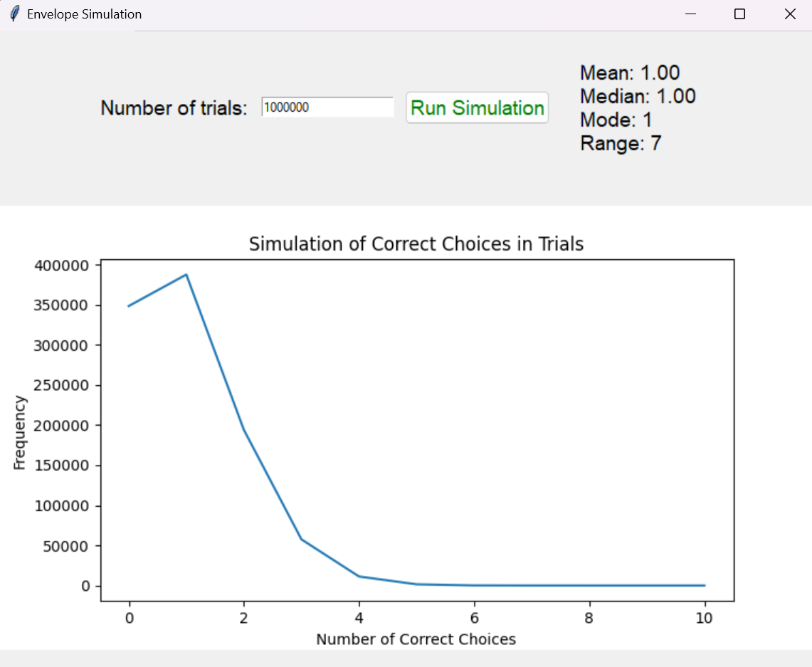

# Simulation Program

This is a statistical simulation program that calculates the number of correct choices in shuffled envelopes. The program uses a graphical user interface to display the plotted results.

## Requirements

- Python 3.x
- `matplotlib`
- `numpy`

## Installation

1. Clone the repository or download the main.py script.

2. Navigate to the project directory with the terminal.

3. Install the required packages with `pip:

   ```sh
   pip install -r requirements.txt

4. Run main.py
